# 1，随机森林算法

## 1.1 回顾bagging和decision tree

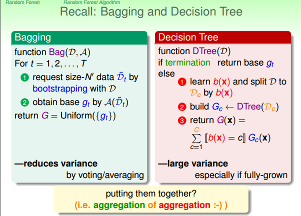

* 偏差：偏差度量了学习算法的期望预测与真实结果的偏离程度, 即刻画了学习算法本身的拟合能力
* 方差：方差度量了同样大小的训练集的变动所导致的学习性能的变化, 即刻画了数据扰动所造成的影响

* 给定一个学习任务, 在训练初期, 由于训练不足, 学习器的拟合能力不够强, 偏差比较大, 也是由于拟合能力不强, 数据集的扰动也无法使学习器产生显著变化, 也就是欠拟合的情况;

* 随着训练程度的加深, 学习器的拟合能力逐渐增强, 训练数据的扰动也能够渐渐被学习器学到;

* 充分训练后, 学习器的拟合能力已非常强, 训练数据的轻微扰动都会导致学习器发生显著变化, 当训练数据自身的、非全局的特性被学习器学到了, 则将发生过拟合.

我们之前学习过bagging，bagging主要是通过bootstrping来产生一系列随机地数据从而得到不同的gt，然后通过uniform的方式aggregation起来，能够有效地减少base algorithm的variance。

我们也学习过决策树，拿到数据之后想办法建一棵树出来，建一棵树的方式是通过递归地建立一些小小的树，然后跟这些分支的条件把它结合起来。但是我们的decision tree对不同的资料相对敏感一些（没有剪枝），不同的资料可能切成不同的树，有比较大的variance。

那能不能将他们结合起来取长补短呢？

## 1.2 Random Forest

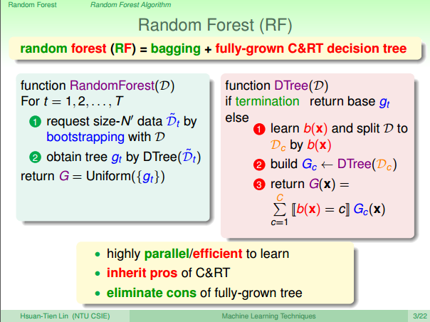

* random：指的是bagging里面的random
* forest：指的是base algorithm是决策树，很多树构成森林

bagging可以实现平行化的学习，而且decision tree本身具有很多很多优点，并且还不需要进行决策树的剪枝。

## 1.3 Feature Projection

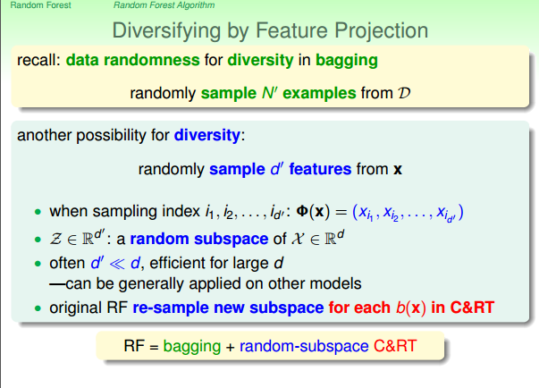

我们除了可以在bagging中通过bootstrap来产生差异性的gt，同时可以通过在C&RT中的b(x)学习的时候，通过feature projection将高纬度的空间映射到低纬度的空间来产生更多的差异性。

## 1.4 Feature Expansion

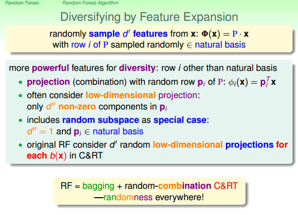

上一小节我们将高维度特征投影到了一个低维度的特征，在这一节，我们不仅如此，我们不但投影到了低纬度的特征，我们还做了一个low-dimension projection的工作，使低维度的每一个特征由少数几个其他特征线性地组合起来

# 2. Out-of-bag esimate

## 2.1 Out-of-bag examples

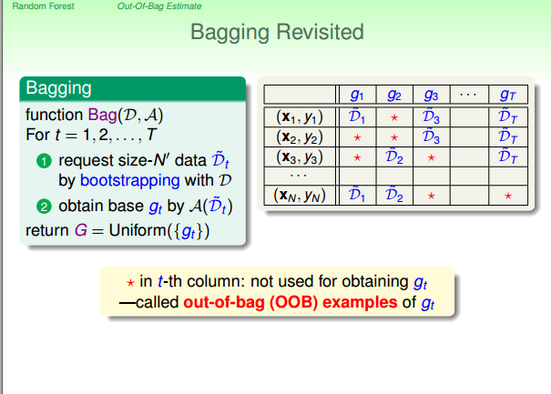

在bagging中，每次学习gt只会选择部分的examples，所以在学习gt的时候没有被选中的example就称为gt的out-of-bag examples，

## 2.2 OOB的数量

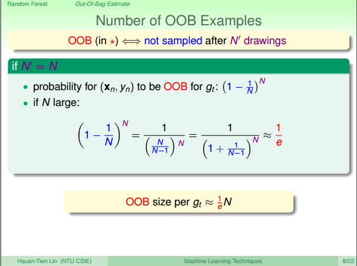

假设数据集大小为N，而bagging的时候抽取的数据大小也是N，那么可以推导出在N比较大的时候，每个gt的OOB的数量大概会是N的1/3。那有什么用呢？

## 2.2 OOB vs validation

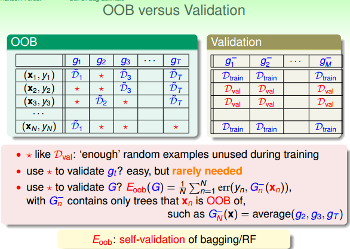

在validation的时候，我们用专门的Dval来衡量g-的性能，然后选出一个性能最好的。因为Dval没有用于学习g-，所以可以用Dval来衡量g-。

类似于validation，我们的OOB可以用于验证gt的表现，但是不需要，因为我们是aggregation。

但是我们可以利用这个特性来验证G(因为RF中有投影的特性，所以可用于选择投影矩阵),验证的方法是轮流测试每一笔资料，例如第N笔，可以用于g2,g3,gt的验证，然后将验证的结果平均，得到GN-。我们可以得到所有资料的Gn-，然后将这些资料的Gn-平均得出G的验证结果。

这叫做Eobb。我们的bagging或者RF算法均有这样的self-validation特性

# 3. Featrue selection

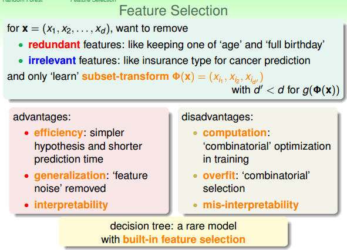

如果现在输入的维度很高，10000个维度，想要删除一些：

* 冗余的：重复的信息
* 无关的：和决策没有关系

将高维度的空间转换到低维度叫做feature selection， 

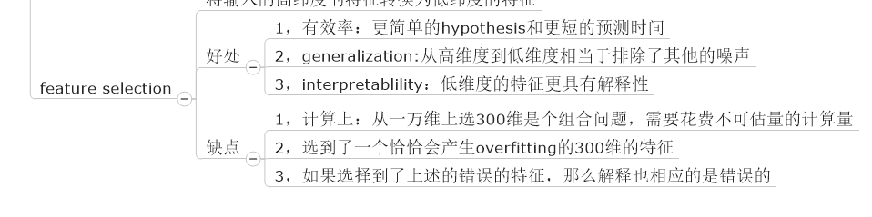

所以我们的feature selection也不是容易的。有专门的理论讲解feature selection的方法，但现在我们说明如何用RF来做feature selection。

## 3.1 根据重要性来选择特征

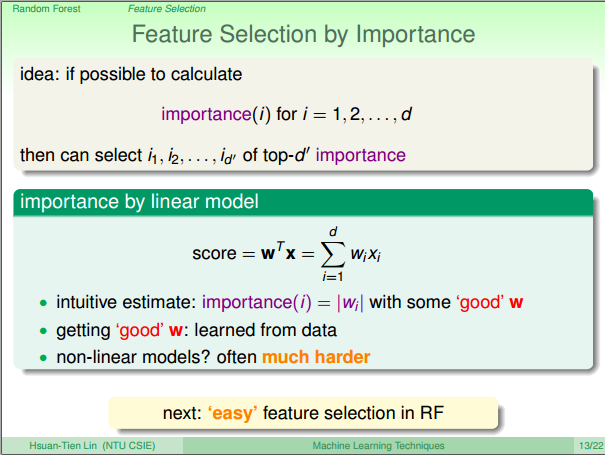

我们可以根据重要性来选择特征。重要性如何衡量呢？

在线性模型中，如果每个特征的范围差别不大的话，那么每个维度的Wi的绝对值大小|Wi|反映了特征的重要性。

但是对于非线性模型，这是比较困难的。

## 3.2 利用RF来选择特征

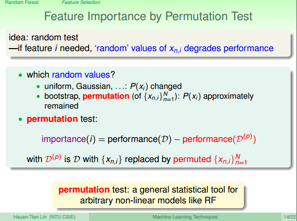

RF用random test来做选择。如果某一个特征很重要，那么如果在这一个特征上面加入一些随机地噪声的话，那么学习的表现肯定会变差。

具体方式是使用permutation，将所有数据这一特征做一个洗牌。

这个做法叫做permutation test。

但是这个RF有什么关系呢？所有的非线性模型都可以使用这种方式啊。

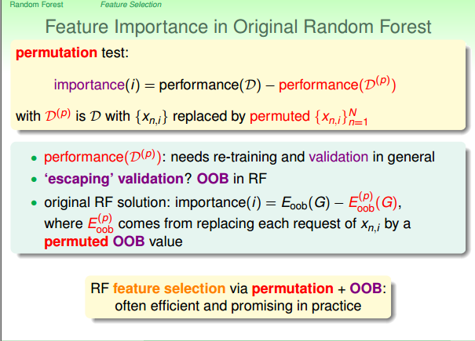

所以现在来谈谈为什么做permutation test的时候偏偏要使用RF这个model。

通常使用permutation test的话我们需要在重排过的资料上面重新训练得到一个模型，然后再做validation来衡量其性能。

但是RF自带self validation，无需专门的validation。

然后利用在gt的OOB资料里面做permutation，从而实现无需重新学习G。

所以通过permutation（重排OOB特征，实现无需再次学习重排特征的G）+OOB（实现无需专门的validation）可以实现比较有效率的特征选取。

# 4. 实际使用中的random forest

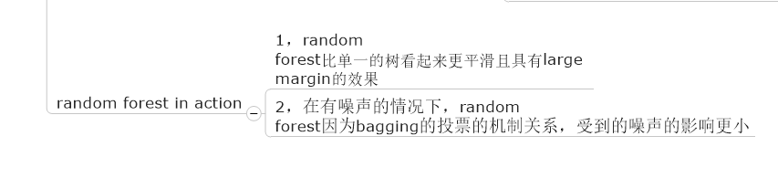

## 4.1 需要多少棵树？

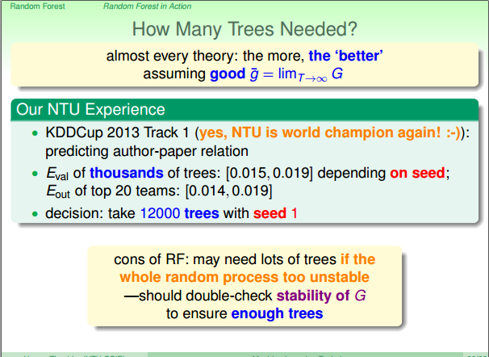

几乎所有的理论都倾向于说越多树越好

